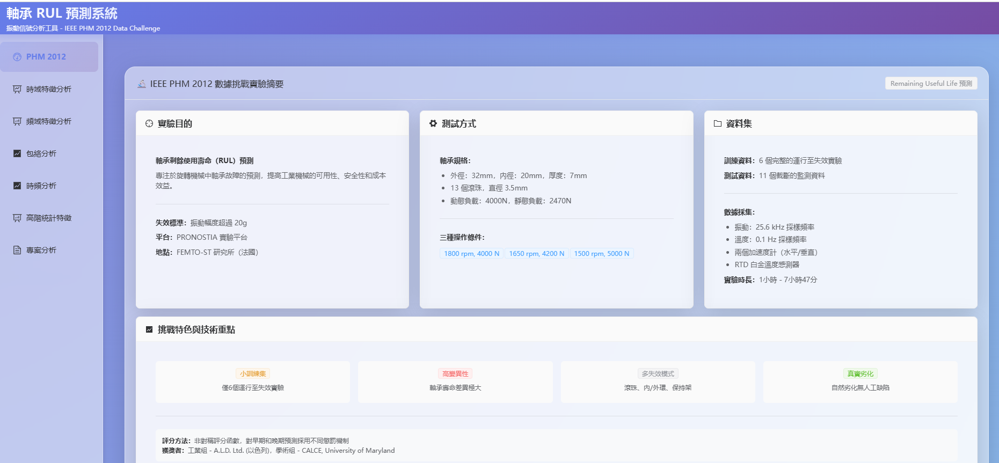
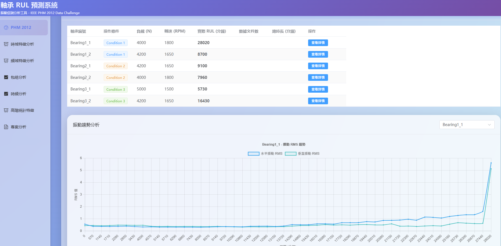
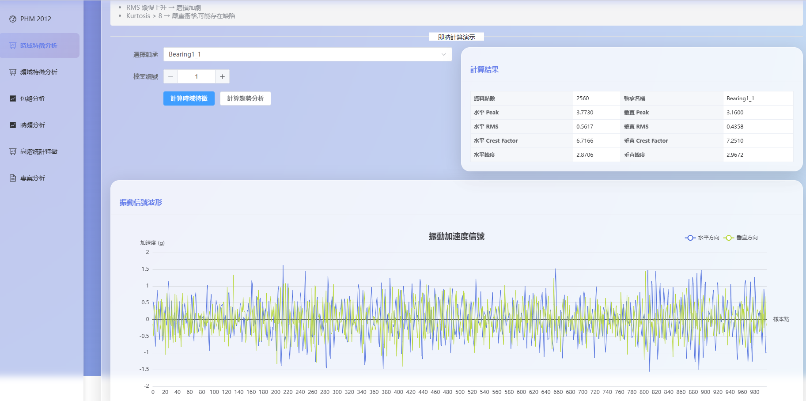
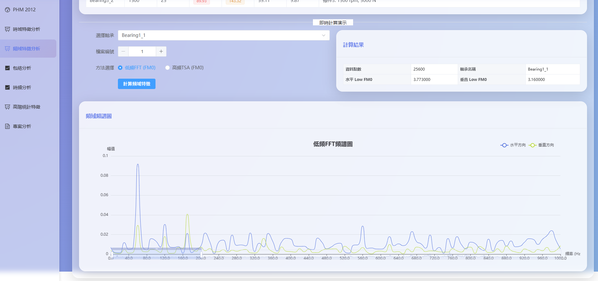
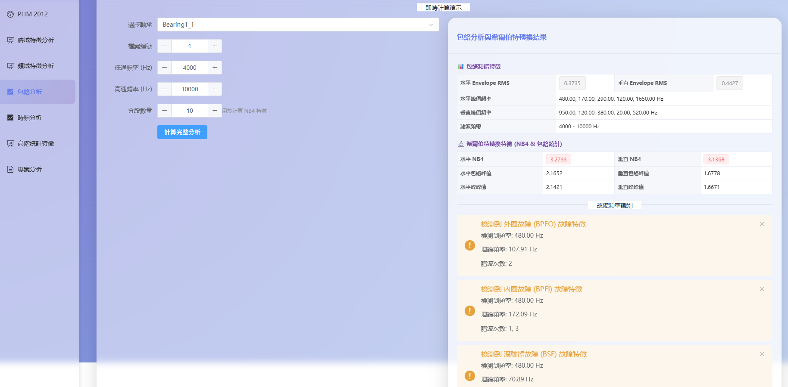
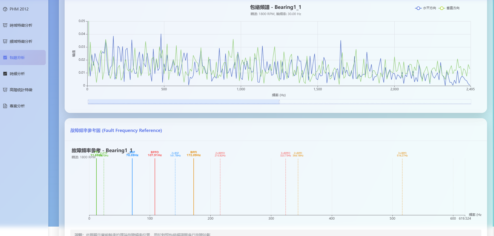
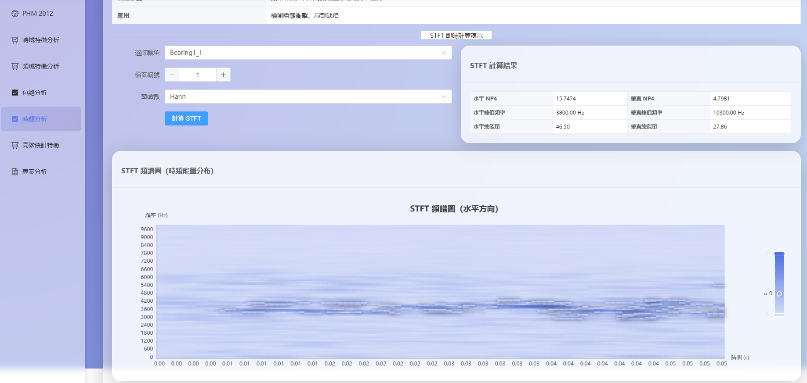
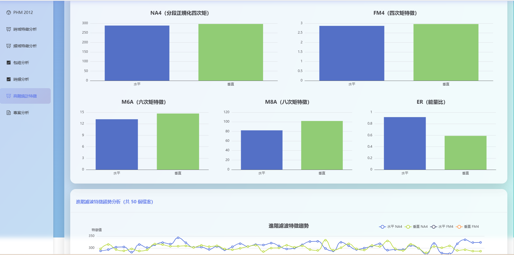

# 🔧 振動信號分析平台

基於 IEEE PHM 2012 數據挑戰的軸承剩餘使用壽命（Remaining Useful Life, RUL）預測與振動信號分析平台。整合 Vue 3 前端與 FastAPI 後端，提供完整的軸承健康監測與故障診斷解決方案。

## 🎯 平台特色

- **批次分析模式**：基於 IEEE PHM 2012 數據集的歷史數據分析
- **即時監控模式**：支援即時串流信號處理與特徵提取
- **多維度分析**：時域、頻域、時頻域、包絡分析、高階統計
- **雙資料庫架構**：SQLite（批次分析）+ PostgreSQL（即時監控）
- **Redis 緩存機制**：提升即時數據處理效能
- **WebSocket 通訊**：低延遲的即時數據推送

## ✨ 主要功能

### 1. 儀表板（Dashboard）
- IEEE PHM 2012 實驗數據總覽
- PRONOSTIA 平台實驗資訊展示
- 軸承測試條件與失效標準說明
- 快速導航至各分析功能

### 2. 演算法原理說明（Algorithms）
- 時域分析（Time Domain）：Peak, RMS, Kurtosis, Crest Factor, EO
- 頻域分析（Frequency Domain）：FFT, FM0, TSA-FFT
- 包絡分析（Envelope Analysis）：希爾伯特轉換, NB4
- 時頻分析（Time-Frequency）：STFT, CWT, Spectrogram
- 高階統計（Higher-Order Statistics）：NA4, FM4, M6A, M8A, ER
- 診斷準則與故障類型對應表

### 3. 時域分析（Time Domain Analysis）
- 即時計算時域特徵值（水平與垂直方向）
- Peak, Average, RMS, Crest Factor, Kurtosis, EO
- 時域特徵趨勢分析（多檔案）
- 信號波形可視化

### 4. 頻域分析（Frequency Domain Analysis）
- FFT 頻譜分析
- 低頻 FM0 特徵計算
- TSA 高頻 FFT 分析
- 頻域特徵趨勢追蹤
- 峰值頻率檢測與功率譜分析

### 5. 包絡分析（Envelope Analysis）
- 帶通濾波（4-10kHz 頻段）
- 希爾伯特轉換提取包絡
- 包絡頻譜分析
- 包絡統計（均值、標準差、RMS、峰峰值）

### 6. 時頻分析（Time-Frequency Analysis）
- 短時傅立葉轉換（STFT）
- 連續小波轉換（CWT）
- 頻譜圖分析（Spectrogram）
- NP4 特徵計算
- 能量分佈分析

### 7. 高階統計分析（Higher-Order Statistics）
- 進階濾波特徵計算（NA4, FM4, M6A, M8A, ER）
- 分段統計分析
- 高階特徵趨勢追蹤
- 早期故障檢測指標

### 8. PHM 數據庫管理（PHM Database）
- 查看所有軸承資料庫記錄
- 檔案列表與測量數據查詢
- 軸承統計資訊檢視
- 異常振動數據搜尋

### 9. PHM 訓練資料（PHM Training）
- 訓練集摘要資訊
- 預處理分析結果
- 振動統計數據檢視

### 10. 溫度數據分析
- 溫度資料庫查詢（支持水平與垂直方向）
- 溫度趨勢追蹤
- 溫度統計資訊
- 區間搜尋功能

### 11. 即時分析（Real-time Analysis）🆕
- 即時串流信號處理與特徵提取
- WebSocket 低延遲數據推送
- 即時特徵計算（時域、頻域、包絡）
- 多感測器並發監控
- 智能告警系統（閾值檢測、異常識別）
- 數據緩衝管理（滑動窗口、緩衝區）
- 即時圖表視覺化
- PostgreSQL 高效能資料庫
- Redis 快取與發布/訂閱
- 告警確認與歷史記錄

## 📸 系統截圖










## 🏗️ 技術架構

### 前端（Frontend）
- **框架**: Vue 3 (Composition API)
- **UI 組件**: Element Plus
- **路由**: Vue Router 4
- **狀態管理**: Pinia
- **圖表**: Chart.js + vue-chartjs, ECharts
- **建構工具**: Vite 5
- **HTTP 客戶端**: Axios

### 後端（Backend）
- **框架**: FastAPI 0.104+
- **伺服器**: Uvicorn
- **資料庫**:
  - SQLite（批次分析：PHM 振動數據庫 + 溫度數據庫）
  - PostgreSQL 15（即時監控：異步操作、高效能查詢）
- **緩存系統**: Redis 7.2（發布/訂閱、數據快取）
- **即時通訊**: WebSocket（低延遲推送）
- **異步處理**: asyncio、asyncpg、aiofiles
- **數據處理**: NumPy, Pandas, SciPy
- **小波分析**: PyWavelets
- **CORS 中間件**: 支持跨域請求
- **任務隊列**: Celery + Redis（背景任務處理）

### 容器化部署（Docker）
- **容器編排**: Docker Compose
- **後端服務**: Python 3.11 基於映像
- **前端服務**: Node.js 開發環境
- **健康檢查**: 自動服務監控
- **持久化存儲**: Volume 掛載數據庫

### 核心演算法模組
整合完整的振動分析模組：
- `timedomain.py` - 時域特徵（Peak, RMS, Kurtosis, CF, EO）
- `frequencydomain.py` - 頻域特徵（FFT, FM0, TSA-FFT）
- `filterprocess.py` - 濾波與高階統計（NA4, FM4, M6A, M8A, ER）
- `timefrequency.py` - 時頻分析（STFT, CWT, Spectrogram）
- `hilberttransform.py` - 希爾伯特轉換（包絡分析, NB4）
- `phm_query.py` - PHM 數據庫查詢模組
- `phm_temperature_query.py` - 溫度數據查詢模組
- `phm_processor.py` - PHM 數據處理器

### 即時分析模組（Real-time Stack）🆕
- `realtime_analyzer.py` - 即時特徵提取引擎
- `buffer_manager.py` - 數據緩衝管理（滑動窗口、環形緩衝）
- `websocket_manager.py` - WebSocket 連線管理
- `redis_client.py` - Redis 客戶端（快取、發布/訂閱）
- `database_async.py` - 異步資料庫操作（PostgreSQL）

## 📦 安裝與運行

### 前置需求
- Python 3.10+（推薦使用 uv 套件管理器）
- Node.js 16+
- Docker & Docker Compose（推薦用於容器化部署）
- PostgreSQL 15+（即時分析功能）
- Redis 7.2+（即時分析功能）
- npm 或 yarn

### 1. 本地開發（推薦使用 uv）

#### 後端設置
```bash
# 安裝 uv（如果尚未安裝）
pip install uv

# 創建虛擬環境並安裝依賴
cd backend
uv venv
source .venv/bin/activate  # Linux/Mac
# 或 .venv\Scripts\activate  # Windows

# 設置環境變數（複製並編輯）
cp ../.env.example ../.env
# 編輯 .env 文件，配置 PostgreSQL 和 Redis 連線

# 使用 uv 運行後端
uv run python main.py
```

後端將運行於 `http://localhost:8081`

API 文檔: `http://localhost:8081/docs`

#### 前端設置
```bash
cd frontend

# 安裝依賴
npm install

# 啟動開發服務器
npm run dev
```

前端將運行於 `http://localhost:5173`

### 2. Docker 容器化部署（推薦）

```bash
# 設置環境變數（首次運行）
cp .env.example .env
# 編輯 .env 文件以自訂配置

# 啟動所有服務（前端 + 後端 + PostgreSQL + Redis）
docker-compose up -d

# 查看日誌
docker-compose logs -f backend
docker-compose logs -f frontend

# 停止服務
docker-compose down

# 停止並清理數據卷（⚠️ 會刪除數據）
docker-compose down -v
```

服務訪問地址：
- 前端：`http://localhost:5173`
- 後端 API：`http://localhost:8081`
- API 文檔：`http://localhost:8081/docs`
- PostgreSQL：`localhost:5432`
- Redis：`localhost:6379`

### 3. 生產環境建構

```bash
# 前端建構
cd frontend
npm run build

# 後端使用 Uvicorn 部署
cd backend
uvicorn main:app --host 0.0.0.0 --port 8081
```

## 📊 資料庫結構

### PHM 振動數據庫（phm_data.db）
```sql
bearings (軸承表)
- bearing_id: Integer (主鍵)
- bearing_name: String (如 "Bearing1_1")
- description: String

measurement_files (測量檔案表)
- file_id: Integer (主鍵)
- bearing_id: Integer (外鍵)
- file_number: Integer (檔案編號)
- created_at: DateTime

measurements (測量數據表)
- measurement_id: Integer (主鍵)
- file_id: Integer (外鍵)
- horizontal_acceleration: Float (水平加速度)
- vertical_acceleration: Float (垂直加速度)
```

### PHM 溫度數據庫（phm_temperature_data.db）
```sql
bearings (軸承表)
- bearing_id: Integer (主鍵)
- bearing_name: String
- description: String

measurement_files (測量檔案表)
- file_id: Integer (主鍵)
- bearing_id: Integer (外鍵)
- file_number: Integer

temperature_measurements (溫度測量表)
- measurement_id: Integer (主鍵)
- file_id: Integer (外鍵)
- horizontal_temperature: Float
- vertical_temperature: Float
```

### PostgreSQL 即時分析資料庫（vibration_analysis）🆕
```sql
sensors (感測器表)
- sensor_id: UUID (主鍵)
- sensor_name: String
- sensor_type: String (accelerometer, temperature, etc.)
- sampling_rate: Float
- status: String (active, inactive, error)
- created_at: Timestamp

sensor_data (感測器數據表)
- data_id: BigSerial (主鍵)
- sensor_id: UUID (外鍵)
- timestamp: Timestamp
- channel_1: Float (水平方向)
- channel_2: Float (垂直方向)
- features: JSONB (特徵值)

features (特徵值表)
- feature_id: BigSerial (主鍵)
- sensor_id: UUID (外鍵)
- timestamp: Timestamp
- feature_name: String
- feature_value: Float

alerts (告警記錄表)
- alert_id: UUID (主鍵)
- sensor_id: UUID (外鍵)
- alert_type: String
- severity: String (info, warning, critical)
- message: Text
- acknowledged: Boolean
- created_at: Timestamp
```

## 🔌 API 端點

### PHM 數據管理
- `GET /api/phm/training-summary` - 獲取訓練集摘要
- `GET /api/phm/analysis-data` - 獲取預處理分析數據

### PHM 數據庫查詢
- `GET /api/phm/database/bearings` - 獲取所有軸承列表
- `GET /api/phm/database/bearing/{bearing_name}` - 獲取特定軸承資訊
- `GET /api/phm/database/bearing/{bearing_name}/files` - 獲取檔案列表（分頁）
- `GET /api/phm/database/bearing/{bearing_name}/measurements` - 獲取測量數據（分頁）
- `GET /api/phm/database/bearing/{bearing_name}/file/{file_number}/data` - 獲取完整檔案數據
- `GET /api/phm/database/bearing/{bearing_name}/statistics` - 獲取統計資訊
- `GET /api/phm/database/bearing/{bearing_name}/anomalies` - 搜尋異常振動數據

### 時域分析
- `GET /api/algorithms/time-domain/{bearing_name}/{file_number}` - 計算時域特徵
- `GET /api/algorithms/time-domain-trend/{bearing_name}` - 計算時域特徵趨勢

### 頻域分析
- `GET /api/algorithms/frequency-domain/{bearing_name}/{file_number}` - 計算 FFT 頻譜
- `GET /api/algorithms/frequency-domain-trend/{bearing_name}` - 計算頻域特徵趨勢
- `GET /api/algorithms/frequency-fft/{bearing_name}/{file_number}` - 計算低頻 FM0 特徵
- `GET /api/algorithms/frequency-tsa/{bearing_name}/{file_number}` - 計算 TSA 高頻 FFT

### 包絡分析
- `GET /api/algorithms/envelope/{bearing_name}/{file_number}` - 計算包絡頻譜
- `GET /api/algorithms/hilbert/{bearing_name}/{file_number}` - 希爾伯特轉換與 NB4

### 時頻分析
- `GET /api/algorithms/stft/{bearing_name}/{file_number}` - 短時傅立葉轉換
- `GET /api/algorithms/cwt/{bearing_name}/{file_number}` - 連續小波轉換
- `GET /api/algorithms/spectrogram/{bearing_name}/{file_number}` - 頻譜圖分析

### 高階統計分析
- `GET /api/algorithms/higher-order/{bearing_name}/{file_number}` - 計算高階統計特徵（舊版，已整合至 filter-features）
- `GET /api/algorithms/filter-features/{bearing_name}/{file_number}` - 計算進階濾波特徵（NA4, FM4, M6A, M8A, ER）
- `GET /api/algorithms/filter-trend/{bearing_name}` - 計算進階濾波特徵趨勢

### 溫度數據查詢
- `GET /api/temperature/bearings` - 獲取所有有溫度資料的軸承
- `GET /api/temperature/bearing/{bearing_name}` - 獲取特定軸承溫度資訊
- `GET /api/temperature/data/{bearing_name}` - 獲取溫度測量資料
- `GET /api/temperature/trends/{bearing_name}` - 獲取溫度趨勢
- `GET /api/temperature/statistics` - 獲取溫度統計資訊
- `GET /api/temperature/search` - 搜尋溫度資料
- `GET /api/temperature/database/info` - 獲取溫度資料庫資訊

### 即時分析與監控（Real-time Analysis）🆕
- `POST /api/stream/start` - 啟動即時串流
- `POST /api/stream/stop` - 停止即時串流
- `GET /api/stream/status` - 獲取串流狀態
- `GET /api/realtime/features/{sensor_id}` - 獲取即時特徵值
- `GET /api/alerts/active` - 獲取活躍告警
- `POST /api/alerts/acknowledge/{alert_id}` - 確認告警
- `GET /api/sensors` - 列出所有感測器
- `GET /api/sensors/{sensor_id}/status` - 獲取感測器狀態
- `GET /api/sensors/{sensor_id}/data` - 獲取感測器數據

### WebSocket 端點🆕
- `WS /ws/realtime/{sensor_id}` - 即時感測器數據推送
- `WS /ws/alerts` - 告警通知推送

## 🎯 使用流程

### 1. 查看 PHM 數據庫
進入「PHM Database」頁面，查看可用的軸承與測量數據。

### 2. 演算法學習
在「Algorithms」頁面學習各種振動分析演算法的原理與應用。

### 3. 執行振動分析
1. 選擇分析類型（時域/頻域/包絡/時頻/高階統計）
2. 選擇軸承與檔案編號
3. 調整參數（採樣率、濾波器頻段等）
4. 查看分析結果與可視化圖表

### 4. 追蹤趨勢
使用各種趨勢分析功能，追蹤軸承健康狀態變化。

### 5. 溫度監測
在溫度數據分析頁面查看軸承溫度變化趨勢。

### 6. 即時監控（🆕 Real-time Monitoring）
1. 進入「Real-time Analysis」頁面
2. 選擇要監控的感測器
3. 啟動即時串流
4. 查看即時特徵值與圖表
5. 接收並處理告警通知
6. 追蹤感測器健康狀態

## 🔍 診斷準則

### IEEE PHM 2012 失效標準
- **振動幅度 > 20g**: 軸承失效
- **加速度超過閾值**: 觸發告警

### 關鍵指標閾值
- **Kurtosis > 8**: 嚴重缺陷
- **NA4 > 3**: 早期故障
- **NB4 顯著增加**: 包絡異常
- **FM4 > 1.5**: 頻域異常
- **M6A/M8A**: 高階矩特徵監測
- **RMS 持續上升**: 磨損加劇

### PRONOSTIA 實驗平台
- **軸承規格**: 外徑 32mm，內徑 20mm，厚度 7mm
- **滾珠數量**: 13 個，直徑 3.5mm
- **負載條件**: 4000N (動態), 2470N (靜態)
- **採樣頻率**: 25.6 kHz
- **測量方向**: 水平與垂直加速度

## 🚀 進階功能

### 趨勢分析
- 時域特徵趨勢（RMS, Peak, Kurtosis 變化）
- 頻域特徵趨勢（FM0 變化）
- 高階統計趨勢（NA4, FM4, M6A, M8A）
- 溫度趨勢追蹤

### 多檔案批量分析
- 支持一次性分析多個檔案
- 自動生成趨勢圖表
- 快速定位異常檔案

### 異常檢測
- 基於閾值的異常振動搜尋
- 支持自訂檢測閾值
- 快速定位潛在故障點
- **即時告警系統**：
  - 多級告警（Info、Warning、Critical）
  - 自動異常檢測
  - 告警確認機制
  - 告警歷史記錄
  - 即時推播通知

## 🛠️ 開發指南

### 新增演算法
1. 在 `backend/` 下新增或修改演算法模組
2. 在 `main.py` 中新增 API 端點
3. 在前端 `views/` 下新增對應分析頁面
4. 更新路由配置 `router/index.js`

### 數據庫擴展
- 修改 `phm_query.py` 添加新的查詢方法
- 更新 API 端點支持新功能
- 前端添加對應的數據展示組件

### 參數調整
- 修改 `backend/config.py` 調整全域配置
- 在各演算法模組中調整閾值參數
- 前端通過 API 參數傳遞自訂配置

## 📁 專案結構

```
Viberation-RUL-Prognostics/
├── backend/                      # FastAPI 後端
│   ├── main.py                  # API 主入口
│   ├── config.py                # 配置文件
│   ├── models.py                # 數據模型
│   ├── phm_models.py            # PHM 數據模型
│   ├── phm_temperature_models.py # 溫度數據模型
│   ├── timedomain.py            # 時域分析
│   ├── frequencydomain.py       # 頻域分析
│   ├── filterprocess.py         # 高階統計
│   ├── timefrequency.py         # 時頻分析
│   ├── hilberttransform.py      # 希爾伯特轉換
│   ├── phm_query.py             # PHM 數據庫查詢
│   ├── phm_temperature_query.py # 溫度數據查詢
│   ├── phm_processor.py         # PHM 數據處理器
│   ├── realtime_analyzer.py     # 🆕 即時分析引擎
│   ├── buffer_manager.py        # 🆕 緩衝管理
│   ├── websocket_manager.py     # 🆕 WebSocket 管理
│   ├── redis_client.py          # 🆕 Redis 客戶端
│   ├── database_async.py        # 🆕 異步資料庫
│   ├── harmonic_sildband_table.py # 諧波分析表
│   ├── initialization.py        # 系統初始化
│   ├── phm_data.db             # SQLite PHM 數據庫
│   ├── phm_temperature_data.db  # SQLite 溫度數據庫
│   └── requirements.txt         # Python 依賴
├── frontend/                    # Vue 3 前端
│   ├── src/
│   │   ├── views/              # 頁面組件
│   │   │   ├── Dashboard.vue
│   │   │   ├── Algorithms.vue
│   │   │   ├── TimeDomainAnalysis.vue
│   │   │   ├── FrequencyDomainAnalysis.vue
│   │   │   ├── EnvelopeAnalysis.vue
│   │   │   ├── TimeFrequencyAnalysis.vue
│   │   │   ├── HigherOrderStatistics.vue
│   │   │   ├── PHMTraining.vue
│   │   │   ├── PHMDatabase.vue
│   │   │   ├── ProjectAnalysis.vue
│   │   │   └── RealtimeAnalysis.vue # 🆕 即時分析頁面
│   │   ├── router/             # 路由配置
│   │   ├── stores/             # Pinia 狀態管理
│   │   │   ├── api.js          # API 狀態
│   │   │   └── realtime.js     # 🆕 即時數據狀態
│   │   ├── services/           # 服務層
│   │   │   └── websocket.js    # 🆕 WebSocket 服務
│   │   ├── config/             # API 配置
│   │   ├── App.vue             # 主組件
│   │   └── main.js             # 入口文件
│   ├── package.json            # Node 依賴
│   ├── vite.config.js          # Vite 配置
│   └── Dockerfile.dev          # 開發環境 Dockerfile
├── docs/                       # 📚 文檔資源
│   ├── System_Analysis.md              # 系統分析
│   ├── Software_Engineering_Challenges.md # 工程挑戰
│   ├── Software_Engineering_Contributions.md # 貢獻文檔
│   ├── UML.md                           # UML 架構文檔
│   ├── Realtime_Analysis_Implementation.md # 🆕 即時分析實作
│   ├── Contribution_Difficulty_Cline.md # 貢獻指南
│   ├── FrequencyDomain.md               # 頻域分析說明
│   ├── Initialization.md                # 初始化指南
│   └── frontend-env-config.md           # 前端環境配置
├── scripts/                    # 工具腳本
│   ├── init_postgres.sql              # PostgreSQL 初始化
│   ├── create_temperature_database.py # 溫度資料庫創建
│   ├── start_backend.sh               # 後端啟動腳本
│   └── start_frontend.sh              # 前端啟動腳本
├── phm_analysis_results/      # 預處理分析結果
├── phm-ieee-2012-data-challenge-dataset/ # 原始數據集
├── .env.example               # 環境變數模板
├── docker-compose.yml         # Docker 編排配置
├── pyproject.toml            # Python 專案配置
├── README.md                 # 專案說明
└── CLAUDE.md                 # 開發指南
```

## 📚 參考資源

### IEEE PHM 2012 Data Challenge
- **主辦單位**: FEMTO-ST 研究所（法國）
- **實驗平台**: PRONOSTIA
- **研究目標**: 軸承剩餘使用壽命（RUL）預測
- **數據集**: 包含完整的軸承退化過程數據

### 相關文檔
- [CLAUDE.md](CLAUDE.md) - 開發指南
- [docs/System_Analysis.md](docs/System_Analysis.md) - 系統架構分析
- [docs/Realtime_Analysis_Implementation.md](docs/Realtime_Analysis_Implementation.md) - 即時分析實作文檔
- [docs/UML.md](docs/UML.md) - UML 架構圖
- [docs/Software_Engineering_Challenges.md](docs/Software_Engineering_Challenges.md) - 工程挑戰與解決方案

### 技術架構演進
本專案從純批次分析系統演進為混合架構平台：

**Phase 1 - 批次分析系統**：
- SQLite 資料庫儲存 PHM 數據集
- 同步 API 處理分析請求
- Vue 3 前端提供操作介面

**Phase 2 - 即時監控系統**（🆕 目前版本）：
- 新增 PostgreSQL 支援高並發寫入
- Redis 提供快取與發布/訂閱機制
- WebSocket 實現低延遲推送
- 異步處理提升吞吐量
- 智能告警系統
- 支援多感測器並發監控

## 🤝 貢獻

歡迎提交 Issue 或 Pull Request！

## 📄 授權

此專案採用 MIT 授權條款。

## 👤 作者

Lin Hung Chuan

---

**🎉 開始您的軸承 RUL 預測之旅！**
