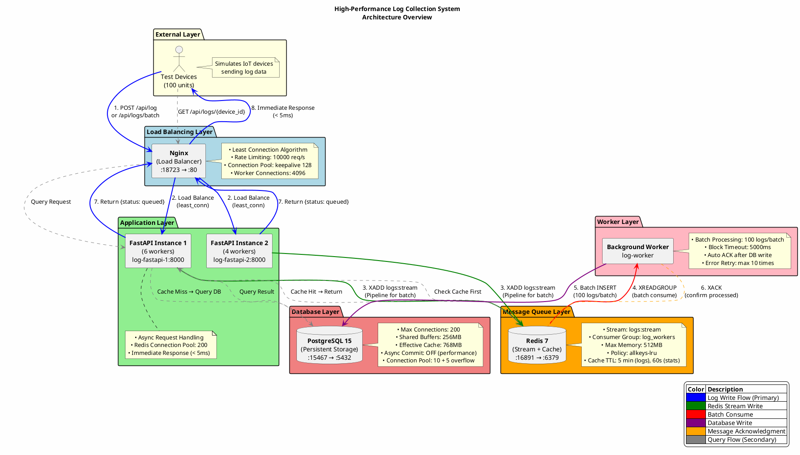

# High-Performance Log Collection System - Architecture Implementation Guide

本文檔詳細說明高日誌收集系統的架構設計、運作流程和實現細節。

## 📋 系統架構概覽

```
Test Devices (100 units)
    ↓
Nginx (Load Balancer) [:18723]
    ↓
FastAPI (2 instances) → Redis Stream → Worker → PostgreSQL
    ↓                    ↓
  Immediate Response   Cached Queries
```

## 🏗️ 架構圖 (PlantUML)

### PlantUML 源代碼



## 📐 架構詳細說明

### 1. 系統分層架構

本系統採用五層分層架構設計，從外到內分別為：

#### External Layer (外部層)
- **測試設備**：模擬 100 台 IoT 設備，負責發送日誌數據
- **職責**：作為系統的數據源，通過 HTTP API 與系統交互

#### Load Balancing Layer (負載均衡層)
- **Nginx** 作為反向代理和負載均衡器
- **端口映射**：監聽外部端口 :18723，轉發到內部 FastAPI 實例 :8000
- **負載均衡算法**：使用 Least Connection 算法分配請求，確保請求平均分佈
- **速率限制**：配置速率限制：10,000 請求/秒，防止系統過載

#### Application Layer (應用層)
- **2 個 FastAPI 實例**，各運行多個 worker 進程
  - **Instance 1**: 6 個 workers，總處理能力高
  - **Instance 2**: 4 個 workers，提供備份和擴展
- **異步處理**：採用異步處理，API 響應時間 < 5ms
- **Redis 連接池**：200 連接，減少連接建立開銷

#### Message Queue Layer (訊息佇列層)
- **Redis 7** 作為訊息佇列和緩存層
- **Stream 配置**：`logs:stream` 存儲待處理的日誌消息
- **Consumer Group**：`log_workers` 管理消費者
- **記憶體配置**：Max Memory: 512MB，使用 LRU 淘汰策略
- **緩存 TTL**：日誌查詢 5 分鐘，統計數據 60 秒

#### Worker Layer (工作者層)
- **Background Worker** 從 Redis Stream 消費消息
- **批處理**：每次處理 100 條日誌
- **阻塞超時**：5000ms，無消息時阻塞等待
- **自動 ACK**：寫入數據庫後確認消息已處理
- **錯誤重試**：最多重試 10 次

#### Database Layer (數據庫層)
- **PostgreSQL 15** 作為持久化存儲
- **連接配置**：
  - 最大連接數：200
  - 共享緩衝區：256MB
  - 有效緩存：768MB
  - 異步提交關閉（提高性能）
- **連接池**：10 + 5 溢出，總共 15 連接

### 2. 數據寫入流程（主要路徑）

```
┌─────────────┐    1. POST /api/log    ┌─────────────┐
│ Test Device │ ──────────────────────>│    Nginx    │
└─────────────┘                        └──────┬──────┘
                                               │
                            2. Load Balance   │ (least_conn)
                                               ↓
                                        ┌─────────────┐
                                        │  FastAPI    │
                                        └──────┬──────┘
                                               │
                        3. XADD logs:stream   │ (Pipeline for batch)
                                               ↓
                                        ┌─────────────┐
                                        │  Redis      │
                                        └──────┬──────┘
                                               │
                     4. XREADGROUP (batch)    │ (count=100)
                                               ↓
                                        ┌─────────────┐
                                        │   Worker    │
                                        └──────┬──────┘
                                               │
                 5. Batch INSERT (100 logs)   │
                                               ↓
                                        ┌─────────────┐
                                        │ PostgreSQL  │
                                        └─────────────┘
                                               │
                 6. XACK (confirm processed)  │
                                               ↓
                                        ┌─────────────┐
                                        │  Redis      │
                                        └─────────────┘
```

#### 寫入流程詳細說明

1. **客戶端發送請求**
   - 測試設備發送 POST 請求到 `/api/log`（單條）或 `/api/logs/batch`（批量）
   - 請求格式包含：`device_id`, `log_level`, `message`, `log_data`

2. **Nginx 負載均衡**
   - Nginx 使用 least_conn 算法將請求轉發到當前連接數最少的 FastAPI 實例
   - 確保請求在多個實例間平均分佈

3. **寫入 Redis Stream**
   - FastAPI 將日誌寫入 Redis Stream (`logs:stream`)
   - 批量操作使用 Pipeline 優化批量寫入，減少網絡往返
   - Stream 限制最大長度為 100,000，實現背壓控制

4. **立即返回響應**
   - FastAPI 立即返回 `{status: "queued", message_id, received_at}`
   - 響應時間 < 5ms，提升用戶體驗
   - 客戶端無需等待數據庫寫入完成

5. **Worker 批量消費**
   - Background Worker 從 Redis Stream 批量讀取消息（每次 100 條）
   - 使用 XREADGROUP 消費者組模式，支持多 Worker 並行消費
   - 阻塞超時 5000ms，無消息時阻塞等待

6. **寫入數據庫**
   - Worker 將批次日誌批量插入 PostgreSQL
   - 單個事務處理 100 條日誌，減少事務開銷
   - 使用連接池復用數據庫連接

7. **確認處理**
   - 成功寫入後，Worker 發送 XACK 確認消息已處理
   - Redis 從待處理佇列中移除消息

#### 關鍵設計優勢

- **解耦請求處理與數據庫寫入**：FastAPI 只需寫入 Redis Stream，不阻塞在數據庫操作
- **批處理減少數據庫 I/O 開銷**：每次寫入 100 條日誌，減少 I/O 操作次數 100 倍
- **立即響應提升用戶體驗**：API 響應時間 < 5ms，大幅提升用戶體驗
- **Redis Stream 作為緩衝區**：實現背壓控制，防止數據庫過載

### 3. 數據查詢流程（緩存路徑）

```
┌─────────────┐    GET /api/logs/{id}   ┌─────────────┐
│ Test Device │ ───────────────────────>│    Nginx    │
└─────────────┘                        └──────┬──────┘
                                               │
                        Forward Request       │
                                               ↓
                                        ┌─────────────┐
                                        │  FastAPI    │
                                        └──────┬──────┘
                                               │
                       Check Cache First       │
                          ┌──────────────┐    │
                          │  Redis Cache │    │
                          └──────┬───────┘    │
                                 │             │
                ┌────────────────┴─────────────┴────────────────┐
                │                                              │
          Cache Hit                                       Cache Miss
                │                                              │
                ↓                                              ↓
       Return cached data                            Query PostgreSQL
                │                                              │
                ↓                                              │
        Fast Response                                  Cache Result
                                                          │
                                                          ↓
                                                   Write to Redis (TTL 300s)
                                                          │
                                                          ↓
                                                   Return Result
```

#### 查詢流程詳細說明

1. **客戶端發送查詢**
   - 測試設備發送 GET 請求到 `/api/logs/{device_id}?limit=100`
   - 支援按設備 ID、日誌級別、時間範圍等條件查詢

2. **檢查緩存**
   - FastAPI 首先檢查 Redis 緩存中是否有結果
   - 緩存 key 格式：`cache:logs:{device_id}:{limit}`
   - 快速返回緩存數據，避免查詢數據庫

3. **緩存命中**
   - 如果緩存命中，直接返回緩存數據
   - 響應極快（通常 < 1ms）

4. **緩存未命中**
   - 如果緩存未命中，查詢 PostgreSQL 數據庫
   - 使用優化的查詢語句和索引

5. **寫入緩存**
   - 將查詢結果寫入 Redis，設置 TTL 為 300 秒（5 分鐘）
   - 下次相同查詢可直接從緩存返回

6. **返回結果**
   - 返回查詢結果，標註數據來源（cache 或 database）
   - 包含總數、數據列表、來源等資訊

#### 緩存策略優勢

- **減少數據庫查詢負載**：緩存命中時無需查詢數據庫
- **提高查詢響應速度**：緩存查詢比數據庫查詢快 10-100 倍
- **自動過期機制確保數據新鮮度**：5 分鐘 TTL 確保數據不會過舊
- **按設備 ID 和 limit 細粒度緩存**：提高緩存命中率

### 4. 組件間互動細節

#### FastAPI 與 Redis 互動

- **連接池配置**：200 連接
- **寫入操作**：
  - XADD 寫入 Stream
  - 批量操作使用 Pipeline
- **讀取操作**：
  - GET 緩存查詢
  - SET 緩存寫入
- **優化策略**：
  - Pipeline 減少網絡往返
  - 連接復用減少連接建立開銷

#### Worker 與 Redis 互動

- **連接池配置**：10 連接
- **消費模式**：
  - XREADGROUP 消費者組模式
  - 支援多 Worker 並行消費
- **批量讀取**：每次讀取 100 條消息
- **確認機制**：XACK 確認已處理

#### Worker 與 PostgreSQL 互動

- **連接池配置**：10 + 5 溢出 = 15 連接
- **批量插入**：每次插入 100 條日誌
- **事務處理**：單個事務保證數據一致性
- **連接復用**：連接池復用減少開銷

#### Nginx 與 FastAPI 互動

- **Keepalive**：128 個長連接
- **超時設置**：
  - 連接超時：5s
  - 發送超時：10s
  - 讀取超時：30s
- **健康檢查**：定期檢查 FastAPI 實例健康狀態
- **故障轉移**：實例故障時自動轉發到健康實例

## 🎯 架構設計原則

| 原則 | 實現方式 | 優勢 |
|------|---------|------|
| **異步處理** | Redis Stream 作為訊息佇列 | 解耦請求處理與數據庫寫入 |
| **批處理優化** | Worker 每次處理 100 條日誌 | 減少數據庫 I/O 開銷 100 倍 |
| **連接池化** | Redis (200), PostgreSQL (10+5) | 消除連接建立開銷 |
| **緩存策略** | Redis 緩存，TTL 5 分鐘 | 減少數據庫查詢負載 |
| **負載均衡** | Nginx least_conn 算法 | 在多個實例間平均分配負載 |
| **水平擴展** | 支援多個 FastAPI/Worker 實例 | 線性擴展吞吐量 |
| **容錯機制** | 健康檢查、自動重啟、重試機制 | 高可用性 |
| **背壓控制** | 速率限制、Stream maxlen | 防止系統過載 |
| **可觀測性** | Prometheus + Grafana 監控 | 即時性能洞察 |

## 📊 相關文檔

- [NGINX-FASTAPI.md](./NGINX-FASTAPI.md) - Nginx 和 FastAPI 詳細配置
- [REDIS_STREAMS_ARCHITECTURE.md](./REDIS_STREAMS_ARCHITECTURE.md) - Redis Streams 架構詳解
- [POSTGRESQL_CONNECTION_POOL.md](./POSTGRESQL_CONNECTION_POOL.md) - PostgreSQL 連接池配置
- [MONITORING.md](./MONITORING.md) - 監控系統設置
- [STRESS_TEST.md](./STRESS_TEST.md) - 壓力測試指南
