# Viberation-RUL-Prognostics Component Diagram

## Component Diagram (PlantUML)

```plantuml
@startuml Component Diagram

!theme plain
skinparam component {
    BackgroundColor<<frontend>> #E6F3FF
    BackgroundColor<<backend>> #FFE6E6
    BackgroundColor<<algorithm>> #FFF5E6
    BackgroundColor<<database>> #E6FFE6
    BackgroundColor<<config>> #F5E6FF
}

' ========================================
' Frontend Layer
' ========================================

component "Vue 3 Application" as VueApp <<frontend>>
component "Vue Router" as Router <<frontend>>
component "Pinia API Store" as APIStore <<frontend>>

package "Analysis Views" <<frontend>> {
    component "Dashboard" as Dashboard
    component "TimeDomainAnalysis" as TimeView
    component "FrequencyDomainAnalysis" as FreqView
    component "EnvelopeAnalysis" as EnvView
    component "TimeFrequencyAnalysis" as TFView
    component "HigherOrderStatistics" as HOSView
    component "PHMDatabase" as PHMView
    component "PHMTraining" as TrainView
    component "ProjectAnalysis" as ProjView
    component "Algorithms" as AlgoView
}

package "Chart Components" <<frontend>> {
    component "ECharts" as ECharts
    component "Chart.js" as ChartJS
}

' ========================================
' Backend API Layer
' ========================================

component "FastAPI Server" as FastAPI <<backend>>
component "CORS Middleware" as CORS <<backend>>
component "Config Manager" as Config <<config>>

package "API Endpoints" <<backend>> {
    component "PHM API" as PHMAPI
    component "Algorithm API" as AlgoAPI
    component "Temperature API" as TempAPI
}

' ========================================
' Business Logic Layer
' ========================================

package "Signal Processing" <<algorithm>> {
    component "TimeDomain" as TimeDomain
    component "FrequencyDomain" as FreqDomain
    component "TimeFrequency" as TimeFreq
    component "HilbertTransform" as Hilbert
    component "FilterProcess" as Filter
}

component "PHMDataProcessor" as PHMProc <<algorithm>>

' ========================================
' Data Access Layer
' ========================================

component "DB Connection Manager" as DBConn <<database>>
component "PHMDatabaseQuery" as PHMQuery <<database>>
component "PHMTemperatureQuery" as TempQuery <<database>>

' ========================================
' Database Layer
' ========================================

database "PHM Database\n(phm_data.db)" as PHMDB <<database>>
database "Temperature Database\n(phm_temperature_data.db)" as TempDB <<database>>
database "Main Database\n(vibration_analysis.db)" as MainDB <<database>>

' ========================================
' Component Relationships
' ========================================

' Frontend relationships
VueApp --> Router : uses
VueApp --> APIStore : manages
APIStore --> FastAPI : HTTP/REST

Router --> Dashboard : routes
Router --> TimeView : routes
Router --> FreqView : routes
Router --> EnvView : routes
Router --> TFView : routes
Router --> HOSView : routes
Router --> PHMView : routes
Router --> TrainView : routes
Router --> ProjView : routes
Router --> AlgoView : routes

TimeView --> ECharts : renders
FreqView --> ECharts : renders
TFView --> ECharts : renders
Dashboard --> ChartJS : renders

' Backend relationships
FastAPI --> CORS : uses
FastAPI --> Config : loads

FastAPI --> PHMAPI : hosts
FastAPI --> AlgoAPI : hosts
FastAPI --> TempAPI : hosts

' API to Business Logic relationships
PHMAPI --> PHMQuery : calls
AlgoAPI --> TimeDomain : calls
AlgoAPI --> FreqDomain : calls
AlgoAPI --> TimeFreq : calls
AlgoAPI --> Hilbert : calls
AlgoAPI --> Filter : calls
AlgoAPI --> PHMProc : uses
TempAPI --> TempQuery : calls

' Data Access relationships
PHMQuery --> DBConn : uses
TempQuery --> DBConn : uses
PHMProc --> DBConn : uses

' Database connections
DBConn --> PHMDB : connects
DBConn --> TempDB : connects
DBConn --> MainDB : connects

' Business Logic to Data Access relationships
TimeDomain --> PHMQuery : queries
FreqDomain --> PHMQuery : queries
Hilbert --> PHMQuery : queries
Filter --> PHMQuery : queries

' ========================================
' Notes
' ========================================

note right of FastAPI
  FastAPI Application
  - RESTful API endpoints
  - Manages database connections
  - Coordinates signal processing modules
end note

note right of DBConn
  Thread-Local Connection Pool
  - One connection per thread
  - Automatic cleanup
  - Connection reuse
end note

note right of APIStore
  Pinia State Store
  - Centralized API calls
  - Request/response caching
  - Error handling
end note

note right of TimeView
  Vue Analysis View
  - User interface for time-domain analysis
  - State management
  - Chart rendering with ECharts
end note

note bottom of PHMDB
  PHM 2012 Dataset
  - Bearing vibration measurements
  - Horizontal & vertical acceleration
  - Temperature data
  - Analysis results
end note

@enduml
```



## Component Diagram Descriptions

### Backend Components

| Component | Type | Description | Key Attributes |
|-----------|------|-------------|----------------|
| FastAPI Server | Application | Main FastAPI application | RESTful API, port 8081 |
| CORS Middleware | Middleware | Cross-origin resource sharing | allow_origins, credentials, methods |
| Config Manager | Configuration | Global configuration settings | Database paths, API settings |
| PHM API | API Endpoint | PHM 2012 data endpoints | Training, analysis, database queries |
| Algorithm API | API Endpoint | Signal processing endpoints | Time, frequency, time-frequency analysis |
| Temperature API | API Endpoint | Temperature data endpoints | Temperature measurements and trends |
| DB Connection Manager | Database | Thread-local connection pool | Per-thread connections |
| PHMDatabaseQuery | Query | PHM data query interface | Bearings, files, measurements |
| PHMTemperatureQuery | Query | Temperature data query interface | Temperature data access |

### Frontend Components

| Component | Type | Description | Key Attributes |
|-----------|------|-------------|----------------|
| Vue 3 Application | Application | Vue 3 SPA application | Composition API, reactive |
| Vue Router | Router | Navigation controller | History mode, 10 routes |
| Pinia API Store | State | API state management | Centralized API calls, caching |
| Dashboard | View | Main dashboard page | Project overview, statistics |
| TimeDomainAnalysis | View | Time-domain analysis page | Peak, RMS, kurtosis features |
| FrequencyDomainAnalysis | View | Frequency-domain analysis page | FFT, fault frequency analysis |
| EnvelopeAnalysis | View | Envelope analysis page | Hilbert transform, harmonics |
| TimeFrequencyAnalysis | View | Time-frequency analysis page | STFT, CWT, spectrogram |
| HigherOrderStatistics | View | Higher-order statistics page | HOS features, skewness |
| PHMDatabase | View | PHM database query page | Bearing data, file listing |
| PHMTraining | View | PHM training data page | Training dataset info |
| ProjectAnalysis | View | Project analysis page | Implementation status |
| Algorithms | View | Algorithm documentation | Feature descriptions |
| ECharts | Chart | Data visualization library | Interactive charts |
| Chart.js | Chart | Statistical chart library | Basic charts |

### Algorithm Components

| Component | Type | Description | Features |
|-----------|------|-------------|----------|
| TimeDomain | Processor | Time-domain analysis | Peak, avg, RMS, crest factor, kurtosis, EO |
| FrequencyDomain | Processor | Frequency-domain analysis | FFT, FM0, TSA, fault frequencies |
| TimeFrequency | Processor | Time-frequency analysis | STFT, CWT, spectrogram |
| HilbertTransform | Processor | Hilbert transform | Envelope, NB4, fault detection |
| FilterProcess | Processor | Advanced filter features | NA4, FM4, M6A, M8A, ER |
| PHMDataProcessor | Processor | PHM data processing | CSV parsing, batch processing |

### Database Components

| Component | Type | Description | Tables |
|-----------|------|-------------|---------|
| PHM Database | Database | PHM vibration database | Bearings, test_data |
| Temperature Database | Database | PHM temperature database | Bearings, files, measurements |
| Main Database | Database | General analysis database | guide_specs, analysis_results |

### Interface/Connection Components

| Component | Type | Description | Protocol |
|-----------|------|-------------|----------|
| HTTP/REST | Interface | Frontend-Backend communication | JSON over HTTP |
| SQLite Connect | Connection | Database connectivity | Thread-local connections |

## Component Interaction Flow

### Request Processing Flow

1. **HTTP Request** arrives at FastAPI Server component
2. Request routed to appropriate API Endpoint (PHM/Algorithm/Temperature)
3. API endpoint calls relevant Query component (PHMDatabaseQuery)
4. Query uses DB Connection Manager for thread-local connection
5. Connection retrieves data from Database component (PHM Database)
6. Data passed to Processor component (FrequencyDomain/TimeDomain)
7. Processor calculates features
8. Response serialized and returned via HTTP/REST interface

### Frontend Interaction Flow

1. User interacts with Vue Component (FrequencyDomainAnalysis)
2. Component triggers action through Pinia API Store
3. Store makes HTTP Request to FastAPI Server
4. Backend processes request (see Request Processing Flow)
5. Response returned to API Store
6. Store updates state
7. Component receives reactive data update
8. Component renders with ECharts or Chart.js component
9. Visualization displayed to user

### Component Data Flow

```
User Interface (Vue Views)
    ↓ User Action
Pinia API Store
    ↓ HTTP/REST Request
FastAPI Server → API Endpoints
    ↓ Component Call
Signal Processing Modules (TimeDomain, FrequencyDomain, etc.)
    ↓ Query
DB Connection Manager
    ↓ Connect
Databases (PHM, Temperature, Main)
    ↓ Data Retrieval
Signal Processing Features
    ↓ Response JSON
Pinia API Store
    ↓ State Update
Chart Components (ECharts, Chart.js)
    ↓ Render
User Visualization
```

## Component Dependencies

### Frontend Dependencies
- Vue 3 Application depends on: Vue Router, Pinia API Store
- Analysis Views depend on: Vue Router, ECharts/Chart.js
- Pinia API Store depends on: FastAPI Server (HTTP/REST)
- Chart Components depend on: Analysis Views (data binding)

### Backend Dependencies
- FastAPI Server depends on: CORS Middleware, Config Manager
- API Endpoints depend on: Query components, Signal Processing modules
- Query components depend on: DB Connection Manager
- Signal Processing modules depend on: Query components, PHMDataProcessor
- DB Connection Manager depends on: Database components

### Cross-Layer Dependencies
- Frontend → Backend: HTTP/REST interface
- Backend → Database: SQLite connections
- API → Business Logic: Component calls
- Business Logic → Data Access: Query interface

## Package Descriptions

### Backend Package

| Sub-package | Description | Key Files |
|------------|-------------|-----------|
| API Layer | FastAPI application with REST endpoints | `main.py` |
| Configuration | Global configuration settings | `config.py` |
| Database Layer | SQLite database models and queries | `database.py`, `phm_query.py`, `phm_temperature_query.py`, `models.py` |
| Time Domain | Time-domain signal processing | `timedomain.py` |
| Frequency Domain | Frequency-domain analysis | `frequencydomain.py` |
| Time-Frequency | Time-frequency analysis methods | `timefrequency.py` |
| Advanced Processing | Advanced signal processing algorithms | `hilberttransform.py`, `filterprocess.py` |
| PHM Data Processing | PHM dataset processing utilities | `phm_processor.py`, `initialization.py` |

### Frontend Package

| Sub-package | Description | Key Files |
|------------|-------------|-----------|
| Application Core | Vue 3 application entry point | `main.js`, `App.vue` |
| Router | Vue Router configuration | `router/index.js` |
| Views | Analysis view components | 10 Vue components for different analyses |
| Configuration | API and environment configuration | `config/api.js` |
| State Management | Pinia store for state management | `stores/api.js` |
| Styles | Unified CSS styling system | `styles/theme-dark.css`, `common-styles.css` |

### Scripts Package

Utility scripts for database creation, data import, and server management.

### Data Package

PHM 2012 Challenge dataset including vibration data, temperature data, and analysis results.

### Deployment Package

Docker configuration files for containerized deployment.

## Dependencies

```
Frontend (Vue 3)
    ↓ HTTP API
Backend (FastAPI)
    ↓
Database Layer (SQLite)
    ↓
Signal Processing Modules
    ↓
PHM Data Files
```
