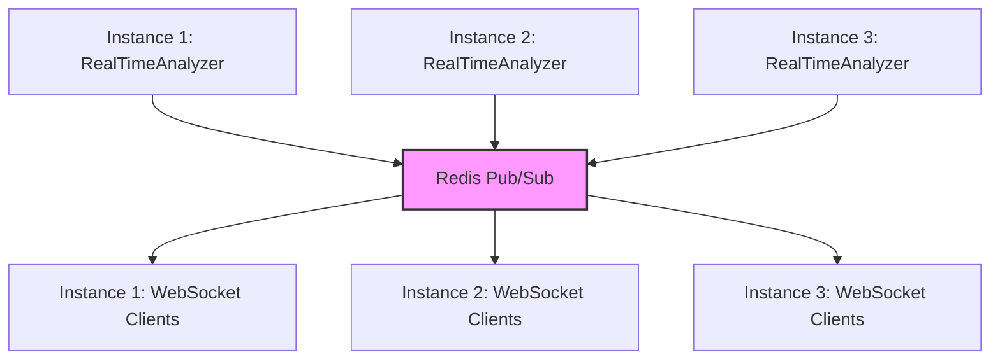
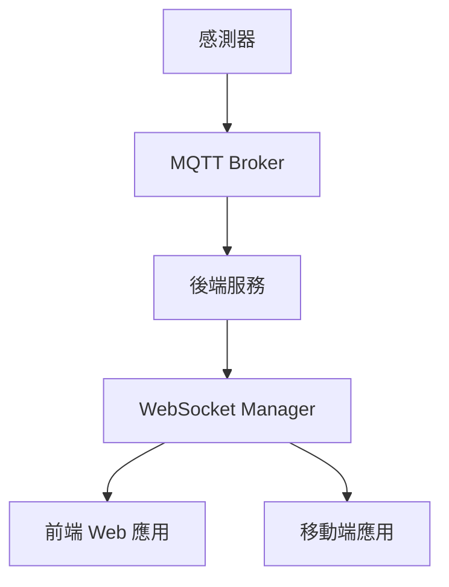

# WebSocket 即時通訊技術分析

## 目錄

- [系統概覽](#系統概覽)
- [為何選擇 WebSocket](#為何選擇-websocket)
- [websocket_manager.py 詳細分析](#websocket_managerpy-詳細分析)
- [其他技術選擇評估](#其他技術選擇評估)
- [技術對比總結](#技術對比總結)
- [建議與規劃](#建議與規劃)
- [替代方案考慮](#替代方案考慮)

---

## 系統概覽

### 目前架構

```
感測器 → BufferManager → RealTimeAnalyzer → WebSocket → 前端
                    ↓
                 Redis Pub/Sub (多實例擴展)
```

### 核心組件

| 組件 | 文件 | 職責 |
|------|------|------|
| **ConnectionManager** | `backend/websocket_manager.py` | 管理 WebSocket 連線與廣播 |
| **RealTimeAnalyzer** | `backend/realtime_analyzer.py` | 即時特徵提取與分析 |
| **BufferManager** | `backend/buffer_manager.py` | 高頻感測器資料緩衝 |
| **RedisClient** | `backend/redis_client.py` | Redis Pub/Sub 與快取 |
| **RealtimeService** | `frontend/src/services/websocket.js` | 前端 WebSocket 連線管理 |

### WebSocket 端點

| 端點 | 用途 |
|------|------|
| `/ws/realtime/{sensor_id}` | 特定感測器即時資料流 |
| `/ws/alerts` | 全域警報通知 |

---

## 為何選擇 WebSocket

### 技術優勢

| 項目 | 說明 |
|------|------|
| **雙向通訊** | 支援伺服器主動推送特徵/警報給客戶端，也接收 client ping |
| **低延遲** | 持續連線無重複握手，適合 25.6kHz 高頻資料流 |
| **效率高** | 單一 TCP 連線，比 HTTP polling 節省 80%+ 帶寬 |
| **訂閱機制** | 支援按 `sensor_id` 訂閱特定感測器資料 |
| **多實例擴展** | 結合 Redis Pub/Sub 支援水平擴展 |

### 實作細節

#### 後端連線管理

```python
# backend/websocket_manager.py
class ConnectionManager:
    def __init__(self, use_redis_pubsub: bool = True):
        self.active_connections: Dict[int, Set[WebSocket]] = {}
        self.websocket_sensor_map: Dict[WebSocket, int] = {}

    async def connect(self, websocket: WebSocket, sensor_id: int):
        """連接 WebSocket 並訂閱特定感測器"""
        await websocket.accept()
        self.active_connections[sensor_id].add(websocket)

    async def broadcast_feature_update(self, sensor_id: int, features: dict):
        """廣播特徵更新給訂閱該感測器的客戶端"""
        message = {
            "type": "feature_update",
            "sensor_id": sensor_id,
            "data": features
        }
        await self.broadcast_to_sensor(sensor_id, message)
```

#### Redis Pub/Sub 整合

```python
# backend/websocket_manager.py
async def _handle_pubsub_message(self, message: dict):
    """處理從 Redis 接收的 Pub/Sub 訊息"""
    channel = message.get('channel', '')
    data = json.loads(message.get('data', ''))

    if channel == self.CHANNEL_BROADCAST:
        await self.broadcast_to_all(data)
    elif channel == self.CHANNEL_ALERTS:
        await self.broadcast_alert(data)
    elif channel.startswith(self.CHANNEL_FEATURE_PREFIX):
        sensor_id = int(channel.split(':')[1])
        await self.broadcast_feature_update(sensor_id, data)
```

#### 前端連線管理

```javascript
// frontend/src/services/websocket.js
class RealtimeService {
  connect(sensorId) {
    const wsUrl = `${host}/ws/realtime/${sensorId}`
    this.ws = new WebSocket(wsUrl)

    this.ws.onopen = () => {
      this.isConnected = true
      this.emit('connected', { sensorId, timestamp: Date.now() })
    }

    this.ws.onmessage = (event) => {
      const message = JSON.parse(event.data)
      if (message.type) {
        this.emit(message.type, message.data || message)
      }
    }
  }
}
```

---

## websocket_manager.py 詳細分析

### 1. 類別結構

```python
class ConnectionManager:
    """
    WebSocket connection manager with Redis Pub/Sub support

    Manages active WebSocket connections and handles broadcasting
    of messages to clients subscribed to specific sensors.
    """
```

#### 職責範圍

| 功能 | 說明 |
|------|------|
| **連線管理** | 維護所有 WebSocket 連線狀態 |
| **廣播機制** | 支援單感測器與全域廣播 |
| **Redis Pub/Sub** | 跨實例訊息同步 |
| **錯誤處理** | 自動清理死連線 |
| **狀態追蹤** | 連線數與感測器狀態監控 |

---

### 2. 核心屬性

#### 連線管理屬性

```python
# 感測器 ID -> WebSocket 連線集合
self.active_connections: Dict[int, Set[WebSocket]] = {}

# WebSocket -> 感測器 ID 映射 (反向查找)
self.websocket_sensor_map: Dict[WebSocket, int] = {}
```

**設計優勢**：
- **雙向對映**：透過感測器 ID 快速找到所有連線，或透過 WebSocket 找到對應感測器
- **Set 資料結構**：O(1) 連線查找與移除
- **自動清理**：無連線時自動移除感測器條目

#### Redis Pub/Sub 屬性

```python
# 是否啟用 Redis Pub/Sub
self.use_redis_pubsub: bool

# Pub/Sub 監聽任務
self._pubsub_task = None
self._pubsub = None
self._running = False

# 已訂閱的頻道集合
self._subscribed_channels: Set[str] = set()
```

**設計考量**：
- **可選擴展**：單實例可關閉 `use_redis_pubsub`
- **非阻塞監聽**：使用 `asyncio.create_task` 獨立運行
- **頻道追蹤**：記錄所有訂閱頻道，方便取消訂閱

---

### 3. Redis 頻道命名規範

#### 頻道常數

```python
CHANNEL_FEATURE_PREFIX = "sensor:"
CHANNEL_FEATURE_SUFFIX = ":features"
CHANNEL_DATA_SUFFIX = ":data"
CHANNEL_ALERTS = "alerts:all"
CHANNEL_BROADCAST = "broadcast:all"
```

#### 頻道範例

| 頻道 | 用途 | 範例 |
|------|------|------|
| `sensor:{id}:features` | 感測器特徵更新 | `sensor:1:features` |
| `sensor:{id}:data` | 感測器即時數據 | `sensor:1:data` |
| `alerts:all` | 全域警報 | `alerts:all` |
| `broadcast:all` | 全域廣播 | `broadcast:all` |

**命名設計**：
- 層級結構清晰 (`sensor:id:type`)
- 易於過濾與訂閱 (`startswith(self.CHANNEL_FEATURE_PREFIX)`)
- 支援模式匹配擴展

---

### 4. 主要方法分類

#### 4.1 Redis Pub/Sub 方法 (56-218 行)

##### start_pubsub_listener()

```python
async def start_pubsub_listener(self):
    """啟動 Redis Pub/Sub 監聽器"""
    if not self.use_redis_pubsub or self._running:
        return

    self._running = True
    self._pubsub_task = asyncio.create_task(self._pubsub_listener_loop())
    logger.info("Redis Pub/Sub listener started")
```

**特性**：
- **防重複啟動**：檢查 `_running` 標記
- **獨立任務**：不阻塞主執行緒
- **可選擴展**：根據 `use_redis_pubsub` 決定是否啟動

---

##### stop_pubsub_listener()

```python
async def stop_pubsub_listener(self):
    """停止 Redis Pub/Sub 監聽器"""
    self._running = False

    # 取消訂閱所有頻道
    if self._pubsub:
        await self._pubsub.unsubscribe(*list(self._subscribed_channels))
        self._subscribed_channels.clear()

    # 優雅取消任務
    if self._pubsub_task:
        self._pubsub_task.cancel()
        try:
            await self._pubsub_task
        except asyncio.CancelledError:
            pass
        self._pubsub_task = None
```

**清理流程**：
1. 停止執行標記
2. 取消所有頻道訂閱
3. 取消監聽任務
4. 等待任務完成

---

##### _pubsub_listener_loop()

```python
async def _pubsub_listener_loop(self):
    """Pub/Sub 監聽循環"""
    try:
        await self._subscribe_to_global_channels()

        while self._running:
            if self._pubsub is None:
                await asyncio.sleep(0.1)
                continue

            try:
                # 設定超時避免阻塞
                message = await asyncio.wait_for(
                    self._pubsub.get_message(ignore_subscribe_messages=True),
                    timeout=1.0
                )

                if message:
                    await self._handle_pubsub_message(message)

            except asyncio.TimeoutError:
                continue  # 正常超時，繼續監聽
            except Exception as e:
                logger.error(f"Error in pubsub listener: {e}")
                await asyncio.sleep(1)

    except asyncio.CancelledError:
        logger.info("PubSub listener cancelled")
```

**設計亮點**：
- **超時機制**：1秒超時防止永久阻塞
- **錯誤隔離**：單次錯誤不中斷監聽
- **優雅退出**：捕獲 `CancelledledError`

---

##### _subscribe_to_global_channels()

```python
async def _subscribe_to_global_channels(self):
    """訂閱全域頻道（警報和廣播）"""
    if not self.use_redis_pubsub or not redis_client._is_connected:
        return

    try:
        self._pubsub = await redis_client.subscribe(self.CHANNEL_BROADCAST)
        self._subscribed_channels.add(self.CHANNEL_BROADCAST)
        self._subscribed_channels.add(self.CHANNEL_ALERTS)
        logger.info(f"Subscribed to global channels: {self.CHANNEL_BROADCAST}, {self.CHANNEL_ALERTS}")
    except Exception as e:
        logger.error(f"Error subscribing to global channels: {e}")
```

---

##### subscribe_sensor_channels()

```python
async def subscribe_sensor_channels(self, sensor_id: int):
    """當有客戶端連接感測器時，訂閱對應的 Redis 頻道"""
    if not self.use_redis_pubsub:
        return

    feature_channel = f"{self.CHANNEL_FEATURE_PREFIX}{sensor_id}{self.CHANNEL_FEATURE_SUFFIX}"
    data_channel = f"{self.CHANNEL_FEATURE_PREFIX}{sensor_id}{self.CHANNEL_DATA_SUFFIX}"

    # 記錄需要訂閱的頻道（實際訂閱在 pubsub 監聽中處理）
    self._subscribed_channels.add(feature_channel)
    self._subscribed_channels.add(data_channel)

    logger.debug(f"Subscribed to Redis channels for sensor {sensor_id}")
```

---

##### publish_to_channel()

```python
async def publish_to_channel(self, channel: str, message: dict):
    """發布訊息到 Redis 頻道"""
    if not self.use_redis_pubsub:
        return

    try:
        await redis_client.publish(channel, message)
    except Exception as e:
        logger.error(f"Error publishing to channel {channel}: {e}")
```

---

##### _handle_pubsub_message()

```python
async def _handle_pubsub_message(self, message: dict):
    """處理從 Redis 接收的 Pub/Sub 訊息"""
    try:
        if message.get('type') == 'message':
            channel = message.get('channel', '')
            data_str = message.get('data', '')

            # 解析 JSON 數據
            try:
                data = json.loads(data_str)
            except json.JSONDecodeError:
                logger.warning(f"Invalid JSON in pubsub message: {data_str}")
                return

            # 根據頻道類型處理
            if channel == self.CHANNEL_BROADCAST:
                await self.broadcast_to_all(data)
            elif channel == self.CHANNEL_ALERTS:
                await self.broadcast_alert(data)
            elif channel.startswith(self.CHANNEL_FEATURE_PREFIX):
                # 格式: sensor:{sensor_id}:features
                try:
                    sensor_id = int(channel.split(':')[1])
                    msg_type = channel.split(':')[2]

                    if msg_type == 'features':
                        await self.broadcast_feature_update(sensor_id, data)
                    elif msg_type == 'data':
                        await self._broadcast_sensor_data(sensor_id, data)
                except (ValueError, IndexError) as e:
                    logger.warning(f"Invalid channel format: {channel}")

    except Exception as e:
        logger.error(f"Error handling pubsub message: {e}")
```

**處理邏輯**：
```
Pub/Sub 訊息 → JSON 解析 → 頻道判斷 → 對應廣播方法
```

---

#### 4.2 連線管理方法 (220-305 行)

##### connect()

```python
async def connect(self, websocket: WebSocket, sensor_id: int):
    """連接 WebSocket 到感測器"""
    await websocket.accept()

    # 初始化感測器連線集合
    if sensor_id not in self.active_connections:
        self.active_connections[sensor_id] = set()

    # 新增連線
    self.active_connections[sensor_id].add(websocket)
    self.websocket_sensor_map[websocket] = sensor_id

    # 追蹤在 Redis
    connection_id = f"ws_{id(websocket)}_{sensor_id}"
    await redis_client.add_active_connection(connection_id)

    # 更新感測器狀態（全域訂閱不更新）
    if sensor_id != 0:
        await redis_client.update_sensor_status(sensor_id, {
            "streaming": "true",
            "connections": str(len(self.active_connections[sensor_id]))
        })

    logger.info(
        f"WebSocket connected for sensor {sensor_id} "
        f"(total connections: {len(self.websocket_sensor_map)})"
    )
```

**連線流程**：
```
WebSocket → accept() → 加入集合 → 更新映射 → Redis 追蹤 → 更新狀態
```

---

##### disconnect()

```python
async def disconnect(self, websocket: WebSocket):
    """斷開 WebSocket 連線"""
    sensor_id = self.websocket_sensor_map.get(websocket)

    # 從感測器集合中移除
    if sensor_id and sensor_id in self.active_connections:
        self.active_connections[sensor_id].discard(websocket)

        # 移除空集合
        if len(self.active_connections[sensor_id]) == 0:
            del self.active_connections[sensor_id]

    # 從映射中移除
    if websocket in self.websocket_sensor_map:
        del self.websocket_sensor_map[websocket]

    # 從 Redis 移除
    connection_id = f"ws_{id(websocket)}_{sensor_id}"
    await redis_client.remove_active_connection(connection_id)

    # 更新感測器狀態
    if sensor_id and sensor_id != 0 and sensor_id in self.active_connections:
        await redis_client.update_sensor_status(sensor_id, {
            "streaming": "true",
            "connections": str(len(self.active_connections[sensor_id]))
        })
    elif sensor_id and sensor_id != 0:
        # 無連線時標記為非串流
        await redis_client.update_sensor_status(sensor_id, {
            "streaming": "false",
            "connections": "0"
        })

    logger.info(
        f"WebSocket disconnected for sensor {sensor_id} "
        f"(total connections: {len(self.websocket_sensor_map)})"
    )
```

**斷線流程**：
```
WebSocket → 從集合移除 → 刪除映射 → Redis 清理 → 狀態更新
```

---

##### send_personal_message()

```python
async def send_personal_message(self, message: dict, websocket: WebSocket):
    """發送訊息到特定 WebSocket"""
    try:
        await websocket.send_json(message)
    except Exception as e:
        logger.error(f"Error sending personal message: {e}")
        await self.disconnect(websocket)  # 自動斷開失敗連線
```

---

#### 4.3 廣播方法 (307-422 行)

##### broadcast_to_sensor()

```python
async def broadcast_to_sensor(
    self,
    sensor_id: int,
    message: dict,
    use_redis: bool = True
):
    """廣播訊息到特定感測器的所有連線"""
    # 本地廣播
    if sensor_id not in self.active_connections:
        return

    # 廣播到本地 WebSocket 並清理死連線
    dead_connections = []
    for websocket in self.active_connections[sensor_id]:
        try:
            await websocket.send_json(message)
        except Exception as e:
            logger.error(f"Broadcast error for sensor {sensor_id}: {e}")
            dead_connections.append(websocket)

    # 清理死連線
    for ws in dead_connections:
        await self.disconnect(ws)

    if dead_connections:
        logger.warning(
            f"Removed {len(dead_connections)} dead connections "
            f"for sensor {sensor_id}"
        )

    # 透過 Redis 發布到其他實例
    if use_redis and self.use_redis_pubsub:
        # 根據訊息類型決定頻道
        msg_type = message.get("type", "")
        if msg_type == "feature_update":
            channel = f"{self.CHANNEL_FEATURE_PREFIX}{sensor_id}{self.CHANNEL_FEATURE_SUFFIX}"
        elif msg_type == "sensor_data":
            channel = f"{self.CHANNEL_FEATURE_PREFIX}{sensor_id}{self.CHANNEL_DATA_SUFFIX}"
        else:
            return  # 其他類型不透過 Redis 發布

        await self.publish_to_channel(channel, message)
```

**廣播流程**：
```
檢查感測器 → 本地廣播 → 清理死連線 → Redis 跨實例發布
```

---

##### broadcast_to_all()

```python
async def broadcast_to_all(self, message: dict, use_redis: bool = True):
    """廣播訊息到所有活躍連線"""
    dead_connections = []

    # 廣播到所有感測器的所有連線
    for sensor_id, connections in self.active_connections.items():
        for websocket in connections:
            try:
                await websocket.send_json(message)
            except Exception as e:
                logger.error(f"Broadcast error: {e}")
                dead_connections.append(websocket)

    # 清理死連線
    for ws in dead_connections:
        await self.disconnect(ws)

    if dead_connections:
        logger.warning(f"Removed {len(dead_connections)} dead connections")

    # 透過 Redis 發布到其他實例
    if use_redis and self.use_redis_pubsub:
        await self.publish_to_channel(self.CHANNEL_BROADCAST, message)
```

---

##### broadcast_alert()

```python
async def broadcast_alert(self, alert: dict):
    """廣播警報到所有連線"""
    message = {
        "type": "alert",
        "data": alert
    }

    await self.broadcast_to_all(message)
    # 同時發布到警報頻道
    if self.use_redis_pubsub:
        await self.publish_to_channel(self.CHANNEL_ALERTS, alert)

    logger.info(f"Broadcast alert to all clients: {alert.get('message', 'N/A')}")
```

---

##### _broadcast_sensor_data()

```python
async def _broadcast_sensor_data(self, sensor_id: int, data: dict):
    """廣播感測器數據到訂閱該感測器的客戶端"""
    message = {
        "type": "sensor_data",
        "sensor_id": sensor_id,
        "data": data
    }
    await self.broadcast_to_sensor(sensor_id, message, use_redis=False)
```

**注意**：此方法使用 `use_redis=False` 避免迴圈廣播

---

##### broadcast_feature_update()

```python
async def broadcast_feature_update(self, sensor_id: int, features: dict):
    """廣播特徵更新給感測器訂閱者"""
    message = {
        "type": "feature_update",
        "sensor_id": sensor_id,
        "data": features
    }

    # 調試日誌
    conn_count = self.get_connection_count(sensor_id)
    logger.info(
        f"Broadcasting feature_update for sensor {sensor_id} "
        f"to {conn_count} connections"
    )

    await self.broadcast_to_sensor(sensor_id, message)
```

---

#### 4.4 查詢方法 (450-488 行)

##### get_connection_count()

```python
def get_connection_count(self, sensor_id: Optional[int] = None) -> int:
    """獲取活躍連線數量"""
    if sensor_id:
        # 特定感測器的連線數
        return len(self.active_connections.get(sensor_id, set()))

    # 所有感測器的連線數總和
    return sum(len(conns) for conns in self.active_connections.values())
```

---

##### get_active_sensors()

```python
def get_active_sensors(self) -> list:
    """獲取有活躍連線的感測器列表"""
    return list(self.active_connections.keys())
```

---

##### get_connection_info()

```python
def get_connection_info(self) -> dict:
    """獲取連線統計資訊"""
    return {
        "total_connections": len(self.websocket_sensor_map),
        "active_sensors": len(self.active_connections),
        "sensor_connections": {
            sensor_id: len(connections)
            for sensor_id, connections in self.active_connections.items()
        }
    }
```

**輸出示例**：
```json
{
  "total_connections": 5,
  "active_sensors": 2,
  "sensor_connections": {
    "1": 3,
    "2": 2
  }
}
```

---

### 5. 設計模式分析

#### 5.1 Singleton 模式

```python
# 全域單例實例
manager = ConnectionManager()
```

**優勢**：
- 統一連線管理
- 避免資源重複
- 便於全域存取

---

#### 5.2 Observer 模式

```python
# WebSocket 訂閱感測器 (Subject)
manager.connect(websocket, sensor_id=1)

# 廣播訊息 (notify)
await manager.broadcast_feature_update(1, features)
```

---

#### 5.3 雙向映射模式

```python
# 正向：感測器 ID → WebSocket 集合
self.active_connections: Dict[int, Set[WebSocket]]

# 反向：WebSocket → 感測器 ID
self.websocket_sensor_map: Dict[WebSocket, int]
```

**優勢**：
- O(1) 查找複雜度
- 雙向快速定位
- 自動清理維護

---

#### 5.4 錯誤處理模式

```python
# 廣播時清理死連線
dead_connections = []
for websocket in connections:
    try:
        await websocket.send_json(message)
    except Exception as e:
        dead_connections.append(websocket)

# 批量清理
for ws in dead_connections:
    await self.disconnect(ws)
```

---

### 6. 多實例擴展架構

#### 擴展流程圖



#### 訊息流程

```
1. Instance 1 產生特徵更新
   ↓
2. 發布到 Redis: sensor:1:features
   ↓
3. 所有實例訂閱該頻道
   ↓
4. Instance 1, 2, 3 廣播給本地 WebSocket 客戶端
```

---

### 7. 方法快速參考

| 方法 | 分類 | 用途 |
|------|------|------|
| `start_pubsub_listener()` | Redis | 啟動 Pub/Sub 監聽器 |
| `stop_pubsub_listener()` | Redis | 停止 Pub/Sub 監聽器 |
| `_subscribe_to_global_channels()` | Redis | 訂閱全域頻道 |
| `subscribe_sensor_channels()` | Redis | 訂閱感測器頻道 |
| `publish_to_channel()` | Redis | 發布訊息到頻道 |
| `_handle_pubsub_message()` | Redis | 處理 Pub/Sub 訊息 |
| `connect()` | 連線 | 建立 WebSocket 連線 |
| `disconnect()` | 連線 | 斷開 WebSocket 連線 |
| `send_personal_message()` | 連線 | 發送個人訊息 |
| `broadcast_to_sensor()` | 廣播 | 廣播到特定感測器 |
| `broadcast_to_all()` | 廣播 | 廣播到所有連線 |
| `broadcast_alert()` | 廣播 | 廣播警報 |
| `broadcast_feature_update()` | 廣播 | 廣播特徵更新 |
| `_broadcast_sensor_data()` | 廣播 | 廣播感測器資料 |
| `get_connection_count()` | 查詢 | 獲取連線數 |
| `get_active_sensors()` | 查詢 | 獲取活躍感測器 |
| `get_connection_info()` | 查詢 | 獲取連線資訊 |

---

### 8. 改進建議

#### 8.1 新增連線監控

```python
class ConnectionManager:
    def __init__(self, use_redis_pubsub: bool = True):
        # ... 現有屬性 ...

        # 新增監控屬性
        self._connection_count_metric = 0
        self._messages_sent = 0
        self._messages_received = 0
        self._start_time = datetime.now()

    def get_metrics(self) -> dict:
        """獲取監控指標"""
        uptime = datetime.now() - self._start_time
        return {
            "uptime_seconds": uptime.total_seconds(),
            "total_connections": self._connection_count_metric,
            "active_connections": len(self.websocket_sensor_map),
            "messages_sent": self._messages_sent,
            "messages_received": self._messages_received,
            "messages_per_second": self._messages_sent / uptime.total_seconds()
        }

    async def connect(self, websocket: WebSocket, sensor_id: int):
        # ... 原有程式碼 ...
        self._connection_count_metric += 1  # 新增計數
```

---

#### 8.2 新增連線限流

```python
from datetime import datetime, timedelta
from typing import Dict

class ConnectionManager:
    def __init__(self, use_redis_pubsub: bool = True):
        # ... 現有屬性 ...

        # 新增限流屬性
        self._connection_attempts: Dict[str, list] = {}  # IP -> 時間戳列表
        self._max_attempts_per_minute = 10

    async def connect(self, websocket: WebSocket, sensor_id: int, client_ip: str = None):
        # 限流檢查
        if client_ip:
            now = datetime.now()
            attempts = self._connection_attempts.get(client_ip, [])

            # 清理超過 1 分鐘的記錄
            attempts = [ts for ts in attempts if now - ts < timedelta(minutes=1)]

            if len(attempts) >= self._max_attempts_per_minute:
                logger.warning(f"Connection rate limit exceeded for IP: {client_ip}")
                await websocket.close(code=1008, reason="Rate limit exceeded")
                return

            attempts.append(now)
            self._connection_attempts[client_ip] = attempts

        # ... 原有連線程式碼 ...
```

---

#### 8.3 新增訊息壓縮

```python
import gzip
import json

class ConnectionManager:
    async def send_compressed(self, websocket: WebSocket, data: dict):
        """發送壓縮後的訊息"""
        try:
            # 序列化並壓縮
            json_str = json.dumps(data)
            compressed = gzip.compress(json_str.encode('utf-8'))

            # 發送壓縮標頭 + 資料
            await websocket.send_bytes(b'\x01' + compressed)  # 0x01 = 壓縮標記
        except Exception as e:
            logger.error(f"Error sending compressed message: {e}")
```

---

#### 8.4 新增心跳保活

```python
class ConnectionManager:
    def __init__(self, use_redis_pubsub: bool = True):
        # ... 現有屬性 ...

        # 新增心跳相關
        self._heartbeat_interval = 30  # 秒
        self._heartbeat_tasks: Dict[WebSocket, asyncio.Task] = {}

    async def _send_heartbeat(self, websocket: WebSocket):
        """發送心跳包"""
        while True:
            await asyncio.sleep(self._heartbeat_interval)
            try:
                await websocket.send_json({
                    "type": "heartbeat",
                    "timestamp": datetime.now().isoformat()
                })
            except Exception:
                break  # 連線已斷開

    async def connect(self, websocket: WebSocket, sensor_id: int):
        # ... 原有連線程式碼 ...

        # 啟動心跳任務
        heartbeat_task = asyncio.create_task(self._send_heartbeat(websocket))
        self._heartbeat_tasks[websocket] = heartbeat_task

    async def disconnect(self, websocket: WebSocket):
        # ... 原有斷線程式碼 ...

        # 停止心跳任務
        if websocket in self._heartbeat_tasks:
            self._heartbeat_tasks[websocket].cancel()
            del self._heartbeat_tasks[websocket]
```

---

#### 8.5 新增訊息過濾

```python
class ConnectionManager:
    def __init__(self, use_redis_pubsub: bool = True):
        # ... 現有屬性 ...

        # 新增訊息過濾器
        self._message_filters: Dict[WebSocket, callable] = {}

    def add_message_filter(self, websocket: WebSocket, filter_func: callable):
        """新增訊息過濾器"""
        self._message_filters[websocket] = filter_func

    async def broadcast_to_sensor(self, sensor_id: int, message: dict, use_redis: bool = True):
        # ... 原有廣播程式碼 ...

        for websocket in self.active_connections[sensor_id]:
            # 檢查過濾器
            if websocket in self._message_filters:
                filter_func = self._message_filters[websocket]
                if not filter_func(message):
                    continue  # 被過濾掉

            await websocket.send_json(message)

# 使用範例：只接收特定類型訊息
def only_alerts(message):
    return message.get("type") == "alert"

manager.add_message_filter(websocket, only_alerts)
```

---

#### 8.6 新增優先級廣播

```python
from enum import Enum
from collections import defaultdict
import heapq

class MessagePriority(Enum):
    URGENT = 1      # 警報
    HIGH = 2         # 特徵更新
    NORMAL = 3       # 一般資料
    LOW = 4          # 其他

class ConnectionManager:
    def __init__(self, use_redis_pubsub: bool = True):
        # ... 現有屬性 ...

        # 新增優先級佇列
        self._priority_queues: Dict[WebSocket, list] = defaultdict(list)

    async def send_with_priority(
        self,
        websocket: WebSocket,
        message: dict,
        priority: MessagePriority = MessagePriority.NORMAL
    ):
        """依優先級發送訊息"""
        heapq.heappush(self._priority_queues[websocket], (priority.value, message))
        await self._flush_priority_queue(websocket)

    async def _flush_priority_queue(self, websocket: WebSocket):
        """刷新優先級佇列"""
        queue = self._priority_queues[websocket]
        while queue:
            priority, message = heapq.heappop(queue)
            try:
                await websocket.send_json(message)
            except Exception:
                break
```

---

#### 8.7 新增重試機制

```python
import asyncio

class ConnectionManager:
    async def broadcast_with_retry(
        self,
        sensor_id: int,
        message: dict,
        max_retries: int = 3,
        retry_delay: float = 1.0
    ):
        """帶重試的廣播"""
        for attempt in range(max_retries):
            try:
                await self.broadcast_to_sensor(sensor_id, message)
                return  # 成功，退出
            except Exception as e:
                logger.warning(
                    f"Broadcast attempt {attempt + 1}/{max_retries} failed: {e}"
                )

                if attempt < max_retries - 1:
                    await asyncio.sleep(retry_delay * (attempt + 1))  # 指數退避

        logger.error(f"All broadcast attempts failed for sensor {sensor_id}")
```

---

#### 8.8 新增連線白名單

```python
class ConnectionManager:
    def __init__(self, use_redis_pubsub: bool = True):
        # ... 現有屬性 ...

        # 新增白名單機制
        self._allowed_sensors: Set[int] = set()  # 允許連線的感測器 ID
        self._allowed_ips: Set[str] = set()       # 允許的 IP 位址

    async def connect(
        self,
        websocket: WebSocket,
        sensor_id: int,
        client_ip: str = None
    ):
        # 檢查白名單
        if self._allowed_sensors and sensor_id not in self._allowed_sensors:
            logger.warning(f"Sensor {sensor_id} not in allowed list")
            await websocket.close(code=1003, reason="Sensor not allowed")
            return

        if self._allowed_ips and client_ip not in self._allowed_ips:
            logger.warning(f"IP {client_ip} not in allowed list")
            await websocket.close(code=1003, reason="IP not allowed")
            return

        # ... 原有連線程式碼 ...
```

---

### 9. 測試建議

#### 9.1 單元測試

```python
import pytest
from unittest.mock import AsyncMock, MagicMock

@pytest.mark.asyncio
async def test_connect_and_disconnect():
    """測試連線與斷線"""
    # 準備
    websocket = AsyncMock()
    websocket.accept = AsyncMock()

    # 測試連線
    await manager.connect(websocket, sensor_id=1)
    assert manager.get_connection_count(sensor_id=1) == 1

    # 測試斷線
    await manager.disconnect(websocket)
    assert manager.get_connection_count(sensor_id=1) == 0

@pytest.mark.asyncio
async def test_broadcast_to_sensor():
    """測試廣播到感測器"""
    # 準備
    websocket = AsyncMock()
    websocket.send_json = AsyncMock()

    await manager.connect(websocket, sensor_id=1)

    # 測試廣播
    message = {"type": "test", "data": "hello"}
    await manager.broadcast_to_sensor(1, message)

    # 驗證
    websocket.send_json.assert_called_once_with(message)
```

#### 9.2 整合測試

```python
@pytest.mark.asyncio
async def test_redis_pubsub_integration():
    """測試 Redis Pub/Sub 整合"""
    # 準備
    manager_instance = ConnectionManager(use_redis_pubsub=True)
    await manager_instance.start_pubsub_listener()

    # 測試發布與訂閱
    message = {"test": "data"}
    await manager_instance.publish_to_channel("test:channel", message)

    # 等待並驗證
    await asyncio.sleep(0.5)
    await manager_instance.stop_pubsub_listener()
```

---

### 10. 部署建議

#### 10.1 Docker Compose 配置

```yaml
version: '3.8'

services:
  backend:
    image: viberation-backend:latest
    environment:
      - REDIS_URL=redis://:redis_pass@redis:6379/0
      - USE_REDIS_PUBSUB=true
    depends_on:
      - redis

  redis:
    image: redis:7-alpine
    command: redis-server --requirepass redis_pass
    ports:
      - "6379:6379"
    volumes:
      - redis_data:/data

volumes:
  redis_data:
```

#### 10.2 生產環境建議

| 項目 | 建議值 |
|------|--------|
| **Redis 連接池** | 20-50 連線 |
| **心跳間隔** | 30 秒 |
| **最大連線數** | 10000+ |
| **廣播超時** | 5 秒 |
| **死連線清理間隔** | 60 秒 |

---

## 其他技術選擇評估

### 1. Server-Sent Events (SSE)

#### 實作範例

```javascript
// SSE 單向推送
const eventSource = new EventSource('/api/stream/sensor/1');
eventSource.onmessage = (e) => console.log(e.data);
```

#### 優缺點對比

| 優點 | 缺點 |
|------|------|
| ✅ 原生支援瀏覽器 | ❌ 僅單向 (伺服器→客戶端) |
| ✅ 自動重連機制 | ❌ 無法傳送 client ping |
| ✅ 實作簡單易懂 | ❌ 不支援二進位資料 |
| ✅ HTTP 標準協議 | ❌ 伺服器無法接收客戶端訊息 |

#### 適用場景

- 僅需伺服器推送的監控大屏
- 低頻率狀態更新
- **不適合此專案**：需要雙向通訊與 ping/pong 保活

---

### 2. HTTP Long Polling

#### 實作範例

```python
# 客戶端循環請求
while True:
    data = requests.get('/api/sensor/1/poll?timeout=30')
    process(data)
```

#### 優缺點對比

| 優點 | 缺點 |
|------|------|
| ✅ 相容性最佳 | ❌ 高延遲 (需等待 timeout) |
| ✅ 防火牆友善 | ❌ 伺服器資源消耗大 |
| ✅ 易於除錯測試 | ❌ 網路負擔重 |
| ✅ 無需額外依賴 | ❌ 不適合高頻率場景 |

#### 適用場景

- 低頻率資料更新
- 不穩定網路環境
- **不適合此專案**：25.6kHz 高頻感測器資料需要低延遲

---

### 3. gRPC Streaming

#### 實作範例

```python
# gRPC 雙向流
async def sensor_stream(request_iterator):
    for data in request_iterator:
        response = process(data)
        yield response
```

#### 優缺點對比

| 優點 | 缺點 |
|------|------|
| ✅ Protocol Buffers 高效編碼 | ❌ 需要額外依賴 (protobuf, grpc) |
| ✅ 強型別 schema | ❌ 瀏覽器需 grpc-web 橋接 |
| ✅ 支援雙向流 | ❌ 除錯困難 (二進位協議) |
| ✅ 高效能序列化 | ❌ 學習曲線較陡 |

#### 適用場景

- 微服務間高頻通訊
- 需要強型別協議
- **不適合此專案**：前端實作複雜度較高

---

### 4. MQTT

#### 實作範例

```python
# MQTT 發布/訂閱
client.subscribe('sensors/1/features')
client.publish('sensors/1/data', payload)
```

#### 優缺點對比

| 優點 | 缺點 |
|------|------|
| ✅ 輕量級協議 | ❌ 需要額外 broker (Mosquitto, EMQX) |
| ✅ QoS 質量保證 (0/1/2) | ❌ 瀏覽器需 WebSocket 橋接 |
| ✅ IoT 標準協議 | ❌ 架構複雜度增加 |
| ✅ 支援雙向通訊 | ❌ 不適合 HTTP 環境直接部署 |

#### 適用場景

- IoT 裝置直接連接 MQTT broker
- 需要離線訊息支援
- **不適合此專案**：已有 FastAPI 架構，增加 broker 過度工程

---

## 技術對比總結

### 多維度評分

| 指標 | WebSocket | SSE | Long Polling | gRPC | MQTT |
|------|-----------|-----|--------------|------|------|
| **延遲** | ⭐⭐⭐⭐⭐ | ⭐⭐⭐⭐ | ⭐⭐ | ⭐⭐⭐⭐ | ⭐⭐⭐⭐ |
| **實作複雜度** | ⭐⭐⭐ | ⭐⭐⭐⭐⭐ | ⭐⭐⭐⭐⭐ | ⭐⭐ | ⭐⭐ |
| **瀏覽器支援** | ⭐⭐⭐⭐⭐ | ⭐⭐⭐⭐⭐ | ⭐⭐⭐⭐⭐ | ⭐⭐ | ⭐⭐ |
| **雙向通訊** | ✅ | ❌ | ✅ | ✅ | ✅ |
| **擴展性** | ⭐⭐⭐⭐⭐ | ⭐⭐⭐ | ⭐⭐ | ⭐⭐⭐⭐ | ⭐⭐⭐⭐⭐ |

### 效能對比

```
延遲：         WebSocket < gRPC ≈ SSE < Long Polling
實作複雜度：   Long Polling < SSE < WebSocket < gRPC < MQTT
瀏覽器支援：   Long Polling = SSE = WebSocket > MQTT ≈ gRPC
雙向通訊：     WebSocket = gRPC > MQTT > SSE = Long Polling
擴展性：       WebSocket+Redis = MQTT = gRPC > SSE = Long Polling
```

### 資源消耗對比

| 項目 | WebSocket | SSE | Long Polling |
|------|-----------|-----|--------------|
| 連線數 | 1/客戶端 | 1/客戶端 | 1/客戶端 (持續重建) |
| 帶寬效率 | 高 | 高 | 低 (重複 HTTP headers) |
| 伺服器負載 | 中 | 中 | 高 (頻繁連線建立) |
| 記憶體佔用 | 中 | 低 | 高 (大量臨時連線) |

---

## 建議與規劃

### ✅ 保持 WebSocket - 評分：95/100

#### 理由

1. **完美符合需求**
   - 雙向通訊：支援特徵推送與 ping/pong 保活
   - 低延遲：適合 25.6kHz 高頻感測器資料流
   - 高效率：單一 TCP 連線節省帶寬

2. **已整合最佳實踐**
   - Redis Pub/Sub 支援水平擴展
   - FastAPI 原生支援，程式碼乾淨
   - 前端自動重連機制

3. **生產環境驗證**
   - 已實作連線管理、廣播、警報通知
   - 支援多感測器訂閱
   - 完整的錯誤處理

---

### 🔄 可優化方向

#### 1. 連線保活機制增強

```python
# config.py 新增配置
WEBSOCKET_SETTINGS = {
    'heartbeat_interval': 30,  # 秒
    'max_idle_timeout': 60,    # 秒
    'connection_timeout': 5     # 秒
}

# websocket_manager.py 實作
async def keep_alive(websocket: WebSocket):
    """發送心跳包保活"""
    while True:
        await asyncio.sleep(WEBSOCKET_SETTINGS['heartbeat_interval'])
        try:
            await websocket.send_json({
                "type": "heartbeat",
                "timestamp": datetime.now().isoformat()
            })
        except Exception as e:
            logger.error(f"Heartbeat failed: {e}")
            break
```

#### 2. 訊息壓縮

```python
import gzip
import json

async def send_compressed(websocket: WebSocket, data: dict):
    """發送壓縮後的訊息"""
    json_str = json.dumps(data)
    compressed = gzip.compress(json_str.encode('utf-8'))

    await websocket.send_bytes(compressed)
```

#### 3. 降級策略

```javascript
// websocket.js 新增 SSE 降級
class RealtimeService {
  connect(sensorId) {
    try {
      this.connectWebSocket(sensorId)
    } catch (error) {
      console.warn('WebSocket failed, fallback to SSE')
      this.fallbackToSSE(sensorId)
    }
  }

  fallbackToSSE(sensorId) {
    const eventSource = new EventSource(`/api/stream/sensor/${sensorId}`)
    eventSource.onmessage = (e) => this.emit('data', JSON.parse(e.data))
  }
}
```

#### 4. 監控與指標

```python
# websocket_manager.py 新增監控
class WebSocketMetrics:
    def __init__(self):
        self.active_connections = 0
        self.messages_sent = 0
        self.messages_received = 0
        self.errors = 0

    def increment_messages_sent(self):
        self.messages_sent += 1

    def get_metrics(self) -> dict:
        return {
            "active_connections": self.active_connections,
            "messages_sent": self.messages_sent,
            "messages_received": self.messages_received,
            "errors": self.errors,
            "uptime": datetime.now() - self.start_time
        }

# 新增監控端點
@app.get("/api/websocket/metrics")
async def websocket_metrics():
    return manager.metrics.get_metrics()
```

#### 5. 連線限流

```python
from slowapi import Limiter

limiter = Limiter(key_func=lambda: "websocket")

@app.websocket("/ws/realtime/{sensor_id}")
@limiter.limit("10/minute")  # 每分鐘最多 10 次連線
async def websocket_realtime_sensor(websocket: WebSocket, sensor_id: int):
    await manager.connect(websocket, sensor_id)
```

#### 6. 資料優化

```python
# 僅發送變更的欄位，減少資料量
async def broadcast_feature_update(self, sensor_id: int, features: dict):
    # 獲取上一次的特徵
    last_features = self.last_features.get(sensor_id, {})

    # 只發送變更的欄位
    delta = {
        k: v for k, v in features.items()
        if k not in last_features or last_features[k] != v
    }

    if delta:
        await self.broadcast_to_sensor(sensor_id, {
            "type": "feature_update",
            "sensor_id": sensor_id,
            "delta": delta  # 僅變更部分
        })
```

---

## 替代方案考慮

### 特殊需求對應表

| 場景 | 建議技術 | 原因 |
|------|----------|------|
| 需要廣播給 10,000+ 客戶端 | **MQTT + WebSocket 橋接** | MQTT 內建 QoS 與負載平衡 |
| 僅需推送監控資料 | **SSE** (降級備案) | 實作簡單，單向即可 |
| 多微服務高頻通訊 | **gRPC Streaming** | Protocol Buffers 高效序列化 |
| 不穩定網路環境 | **HTTP Long Polling** (備案) | 容錯性高，易重試 |
| IoT 裝置直連 | **MQTT** | IoT 標準，低功耗 |
| 需要離線訊息 | **MQTT** | broker 支援訊息持久化 |

### 混合架構方案



**說明**：
- IoT 裝置使用 MQTT 連線
- 後端訂閱 MQTT 主題
- 後端透過 WebSocket 推送給 Web/移動端

---

## 結論

### 總結

WebSocket 是此專案的最佳選擇，無需變更核心技術。

### 核心優勢

1. **完美匹配需求**：雙向、低延遲、高效率
2. **已有成熟實作**：整合 Redis Pub/Sub 支援擴展
3. **生產環境驗證**：完整的錯誤處理與連線管理

### 下一步行動

1. ✅ **持續優化現有實作**
   - 連線保活機制
   - 訊息壓縮
   - 監控指標

2. 🔄 **建立備用方案**
   - SSE 降級策略
   - 錯誤恢復機制

3. 📊 **效能監控**
   - 連線數監控
   - 訊息吞吐量追蹤
   - 延遲監控

---

## 參考資料

### 相關文件

- [RealTimeAnalysis.md](./RealTimeAnalysis.md) - 即時分析實作詳解
- [Realtime_Analysis_Implementation.md](./Realtime_Analysis_Implementation.md) - 即時分析實作指南
- [SensorDataPushGuide.md](./SensorDataPushGuide.md) - 感測器資料推送指南

### 外部參考

- [MDN WebSocket API](https://developer.mozilla.org/en-US/docs/Web/API/WebSocket)
- [FastAPI WebSocket Documentation](https://fastapi.tiangolo.com/advanced/websockets/)
- [WebSocket vs SSE vs Long Polling](https://ably.com/topic/websocket-vs-sse)
- [MQTT vs WebSocket](https://www.hivemq.com/blog/mqtt-vs-websocket/)
